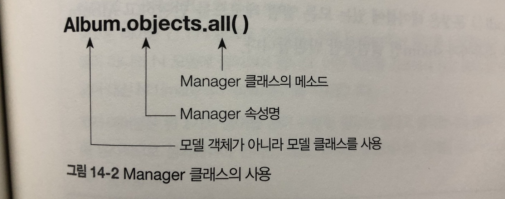
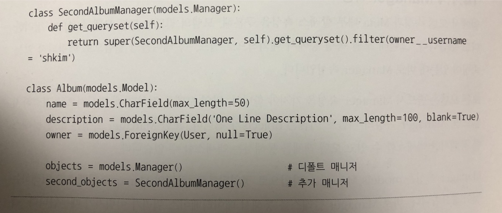

# 모델의 정의

+ 테이블을 클래스로 처리하는 ORM 기법의 특징에 따라, 테이블을 정의하는 모델 클래스는 속성과 메소드를 갖게 된다.
1. 테이블의 컬럼은 모델 클래스의 속성으로 정의
2. 테이블에는 메소드가 없지만 모델 클래스에는 메소드를 정의 할수있음( 테이블에 관련된 메소드들.. )

## 모델 속성
+ ORM 기법의 특징에 따라 테이블의 컬럼은 모델 클래스의 속성으로 정의
+ 모델 클래스에서 필드를 정의하기위해서는 항상 필드명, 필드타입, 필드옵션을 지정
+ 필드타입 역활
    1. 테이블의 컬럼 타입을 지정, 예) CharField 필드 타입은 컬럼의 VARCHAR 타입으로 변환됨.
    2. 폼으로 렌더링되는 경우 HTML 위젯을 지정한다, 예) CharField 필드 타입은 폼으로 사용될 때 
    `<input type="text">` HTML 태그로 변환되고 및 그에 상응하는 위젯을 지정.
    3. 필드 또는 폼에 대한 유효성 검사 시 최소 기준이 된다.
    
 ## 모델 메소드
+ 클래스 메소드와 객체 메소드를 구분
    + `클래스 메소드`는 테이블 레벨에서 동작하는 메소드
    + `객체 메소드`는 레코드 레벨에서 동작하는 메소드
+ 장고에서는 클래스 메소드는 사용하지 않고 객체 메소드만 사용
    + 모델 클래스에 정의하는 모델 메소드는 모두 객체 메소드이며 이메소드들을 호출하면 테이블 단위가 아니라
    레코드단위에만 영향을 미친다
+ 장고는 클래스 메소드를 사용하는 대신 별도의 Manager 클래스를 정의하고 Manager 클래스의 메소드를 통해서
테이블에 대한 CRUD 동작을 수행
+ 메소드는 객체의 문자열 표현을 리턴함
+ 객체는 모두 파이썬의 내부 포멧으로 저장되므로 우리가 읽을 수 없음, 장고의 디폴트 `__str__`() 메소드에 의해 객체의 문자열 표현
+ 메소드가 정의된 객체를 지칭하는 URL을 반환
    + URLconf에서 detailView 제네릭 뷰를 사용하는 경우가 좋은 예
    + DetailView 뷰는 특정 객체에 대한 상세 정보를 보여주는 제네릭 뷰이므로, DetailView와 매핑된 URL을 
    `get_absolute_url()` 메소드를 사용해 구할 수 있기때문, 특정 객체의 URL을 구하는 기능은 코드의 여러 곳에서 필요하므로
    다음 메소드는 항상 정의해주는게 좋다
+ 필드 타입이 DateField 또는 DateTimeField 이면서 필드 옵션이 null=True가 아닌 경우는 다음 메소드를 사용할수 있다
    + `get_next_by_필드명FOO(**kwargs)`    
    + `get_previous_by_필드명FOO(**kwargs)`
+ 필드 옵션에 choices 인자가 있으면, 그모델 객체는 다음 메소드를 제공, FOO 은 choices인자를 갖는 필드를 의미
이 메소드는 FOO 필드의 설명 문자열을 반환
    + `get_필드명FOO_display()`
    
## Meta 내부 클래스 속성
+ 장고에서 모델 클래스의 필드는 아니지만 모델 클래스에 필요한 항목을 Meta 내부 클래스에 정의
+ ordering : 모델  객체의 리스트 출력시 정렬하기위해 사용하는 속성 (필드)명을 지정, 지정필드 기준으로 오름차순이 디폴트이고,
마이너스(-) 접두사를 붙이면 내림차순으로 정렬
    + 예) ordering = ['-필드명']

+ db_table
    + 데이터베이스에 저장되는 테이블 이름을 지정, 이 항목을 지정하지 않으면 장고 디폴트로 앱명_클래스명(소문자)를 테이블명으로 지정
        + db_table = 'table_name'
        
+ verbose_name
    + 사용자가 이해하기 쉬운 모델 객체의 별칭, 이 항목을 지정하지 않으면 장고는 모델 클래스명을 변형해서 디폴트 verbose_name으로 사용 \
    + 예를 들어 모델 클래스명이 FavoritePost라면 디폴트 verbose_name은 favorite post가 된다
        + verbose_name = 'my favorite post'

+ verbose_name_plural
    + verbose_name에 대한 복수 명칭을 지정, 지정하지 않으면 verbose_name + "s"가 사용됨.
    위의 예시라면 디폴트 verbose_name_plural은 favorite posts가 된다
    
## Manager 속성
+ 테이블의 컬럼으로 매핑되지 않는 속성은 Manager 속성
+ 모든 모델은 반드시 Manager속성을 가져야함
+ 모델을 정의할 때 명시적으로 지정하지 않으면, Manager 속성의 디폴트 이름은 objects가 됨.
+ Manager 속성은 모델 클래스를 통해서만 액세스할 수 있고 모델 객체를 통해서는 액세스할 수 없다.
+ Manager 속성은 models.Manager 타입으로 정의되므로, 장고의 Manager 클래스를 이해하는 것이 중요
    + Manager 클래스를 통해서 데이터베이스 쿼리가 이뤄지기 때문
    + 레코드 레벨이 아니라 테이블 레벨에서의 Read 동작은 Manager 클래스의 메소드를 통해 이뤄짐
    

+ QuerySet 객체를 반환, QuerySet 클래스의 메소드와 Manager 클래스의 메소드는 동일(똑같지는 않음)
+ QuerySet 메소드는 모두 Manager 메소드로도 사용 가능
    + `all(), filter(), exclude(), get(), count() 등`

+ objects와 second_objects 두 개의 Manager를 정의 했고, 첫 번째롤 정의된 objects가 디폴트 Manager가 된다.
+ second_objects를 지정하기 위해 SecondAlbumManager 클래스를 새로 정의하면서 get_queryset() 메소드를 오버라이딩함
+ Album.objects.all() 문장은 테이블에 있는 모든 앨범 레코드를 반환하고 Album.second_objects.all() 문장은 소유자가
shkim인 앨범들만 반환함

