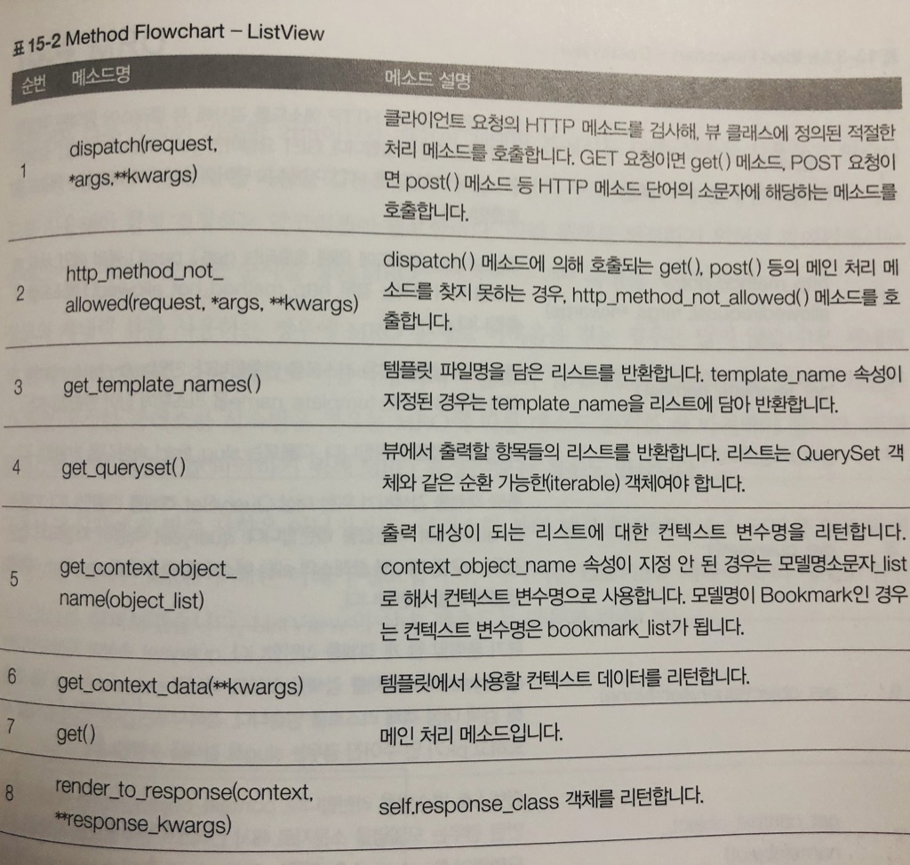
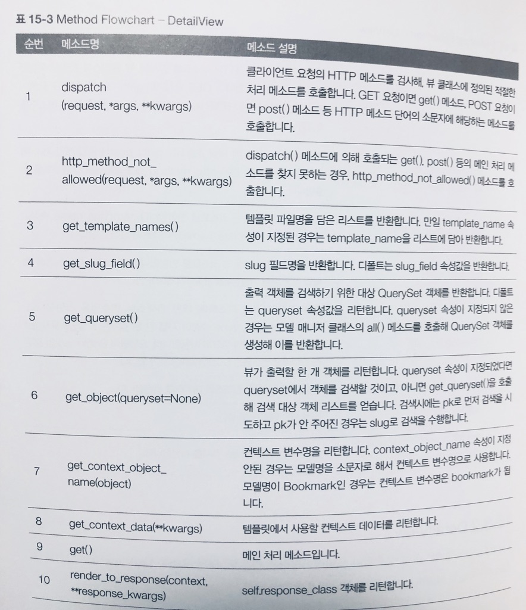

# 메소드 오버라이딩

## get_queryset()

+ 기본 뷰(view, Template, RedirectView) 3개를 제외하고 모든 제네릭 뷰에서 사용하는 메소드
+ 출력 객체를 검색하기 위한 대상 QuerySet 객체 또는 출력 대상인 객체 리스트를 반환
+ 디폴트는 queryset 속성값을 반환
+ queryset 속성이 지정되지 않은 경우는 모델 매니저 클래스의 all() 메소드를 호출해 QuerySet 객체를 생성해 이를 반환

+ 아래 예제는 출력대상을 변경하기
    + 포스트 글에 특정 단어가 들어 있는 객체들만 보여주는 로직으로 변경
    + 특정 단어는 URL에 지정하는 걸로 변경
    + 동적으로 출력대상을 변경하는 기능은 `queryset 속성 오버라이딩으로 불가능`

```
예) urls.py
path('test/<word>/', TestPostLV.as_view(), name='post_test')
```

```
예) views.py
class TestPostLV(ListView):
    model = Post
    .........
    
    def get_queryset(self):
        return Post.objects.filter(Q(content__icontains = self.kwargs['word'])).distinct()    
```

## get_context_data(**kwargs)

+ TemplateView를 포함해 모든 제네릭 뷰에서 사용하는 메소드
+ 템플릿에서 사용할 컨텍스트 데이터를 반환

```
예) views.py
class TestPostLV(ListView)
    model = Post
    ..........
    
    def get_context_data(self, **kwargs):
        context = super(TestPostLV, self).get_context_data(**kwargs)
        context['SearchWord'] = self.kwargs['word']
        return context
```
+ 뷰에서 넘어온 데이터를 출력하기위해 {{ SearchWord }} 컨텍스트 변수사용

## form_valid(form)

+ FormView, CreateView, UpdateView에서 사용
+ get_success_url() 메소드가 반환하는 URL로 리다이렉트 수행


## Method Flowchart


+ ListView




+ DetailView

