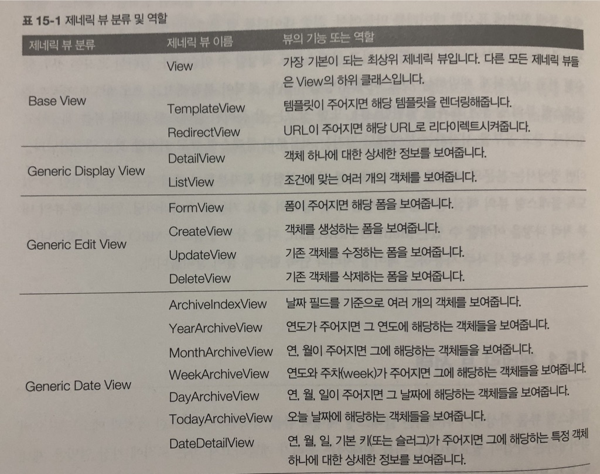

## 제네릭 뷰 선택

1. 개발하고자 하는 로직에 가장 알맞은 제네릭 뷰가 무엇인지를 선택할 수 있어야 한다.
2. 제네릭 뷰를 선택한 다음에는 그 제네릭 뷰에서 어떤 상속과 메소드를 오버라이딩할지 판단



## View

+ 모든 클래스형 뷰의 기본이 되는 최상위 뷰(모든 클래스형 뷰는 View 클래스를 상속받음)
+ 이뷰를 직접 상속받아 코딩하는 경우는 많지 않음
    + 원하는 로직에 맞는 제네릭 뷰가 없는 경우는 이뷰를 상속받아서 클래스형 뷰를 작성할수 있음

```
예)
class TestView(View):
    def get(self, request, *args, **kwargs):
        return HttpResponse('Hello, World!')
```   


## TemplateView

+ 단순하게 화면에 보여줄 템플릿 파일을 처리하는 정도의 간단한 뷰
    + 아주 간단하게는 템플릿 파일만 지정해주면 된다.

+ 아래 예제 HomeView는 TemplateView 제네릭뷰를 상속받고 있으며 home.html 템플릿 파일을 렌더링해서 
화면에 봉여주는 것이 주된 역활임
```
예)
class HomeView(TemplateView):
    template_name = 'home.html'
```

## RedirectView

+ 주어진 URL로 리다이렉트시켜주는 제네릭 뷰
+ URL 속성 필수!!!
+ URL 대신 URL 패턴명이 주어져도 URL을 알아낼 수 있음
    + URL을 알 수 없다면 RedirectView는 HttpResponseGone (410)에러 응답을 발생시킴
+ RedirectView는 복잡한 로직 없이 리다이렉트만을 원할 때 사용하는 뷰

+ 아래 예제의 TestRedirectView를 블로그 앱에 사용한다면, 포스트 리스트화면으로(/blog/post/URL)
리다이렉트시켜주는 역활을 한다.

```
예)
class TestRedirectView(RedirectView):
    url = '/blog/post/'
    # 다음처럼 URL 대신에 패턴명을 지정해도 된다
    # pattern_name = 'blog:post_list'
```

## DetailView

+ 특정 객체 하나에 대한 정보를 보여주는 뷰
+ 자주 사용되는 예는 `테이블에서 기본 키(pk)로 지정된 레코드 하나에 대한 정보를 보여주는 것`

+ 아래 예제의 뷰는 Post테이블에서 특정 레코드 하나를 읽은 후에, 그 레코드를 object 컨텍스트 변수에
담아서 템플릿에 넘겨줌
    + 템플릿 파일에서는 {{ object }} 변수를 사용해, 레코드 정보를 출력

```
예)
class PostDV(DetailView):
    model = Post
```    

+ 특정 레코드를 읽어오는 방법(URLconf)

```
예)
path('post/<slug>/', PostDV.as_view(), name='post_detail')
```

+ slug인자로 Post 테이블을 검색해 slug 컬럼이 레코드를 찾게 된다.
+ DetailView 제네릭 뷰 사용시 테이블은 뷰 클래스에서 지정하고 레코드 검색용 키는 URLconf에서 지정하는 것
    + 레코드 검색용 키는 보통 기본키(pk)를 사용
    
## ListView

+ 여러 객체의 리스트를 보여주는 뷰
+ 자주 사용하는 예는 테이블의 모든 레코드를 리스팅해 준다

+ 아래 예제 뷰는 Post 테이블에서 모든 레코드를 읽은 후에 레코드들을 object_list 컨텍스트 변수에 담아서
템플릿에 넘겨준다
    + 템플릿 파일에서는 {{ object_list }} 변수를 사용해 레코드 리스트를 출력함

```
예)
class PostLV(ListView):
    model = Post
```

## FormView

+ 폼을 보여주기 위한 제네릭 뷰
+ 폼을지정해주는 `form_class`와 폼을 렌더링하는 `template_name` 속성이 주요 속성
+ 폼 처리가 성공한 후에 리다이렉트 목적지 URL을 지정하는 `success_url` 속성도 필요
+ get() 메소드와 post() 메소드를 구분해 서로 처리하는 내용이 다르고 폼을 보여준다음 사용자가 폼에 입력한
데이터가 유효한지 검사도 해야하고 처리가 완료된 후에 적당한 페이지로 이동해야함( 복잡한 과정을 FormView가 다해줌)

+ 아래 예제 살펴보기( 검색 결과를 같은 페이지에 보여주고자 success_url은 사용하지 않음)

```
예)
class SearchFormView(FormView):
    form_class = PostSearchForm
    template_name = 'blog/post_search.html'
    
    def form_vaild(self, form):
        schWord = '%s' % self.request.POST['search_word']
        post_list = Post.objects.filter(Q(title__icontains=schWord) | 
                                        Q(description__icontains=schWord) | 
                                        Q(content__icontains=schWord)).distinct()
        context = {}
        context['form'] = form
        context['search_term'] = schWord
        context['object_list'] = post_list
        
        return render(self.request, self.template_name, context)                                        
``` 

## CreateView

+ 새로운 레코드를 생성해서 테이블에 저장해주는 뷰
+ 새로운 레코드를 생성하기 위해서는 레코드 정보를 입력받을 수 있는 폼이필요
    + CreateView는 FormView 기능을 포함하고 있음
    + 모델 정의로부터 `폼을 자동으로 만들어주는 기능`과 `데이터베이스에 레코드를 저장하는 기능`이 더 추가된 것으로 이해하면 됨

+ 아래 예제 PostCreateView뷰 살펴보기
    + 작업 대상 테이블을 `model`속성으로 지정
    + 폼을 만들 때 사용할 필드를 `fields` 속성으로 정의
    + 처리가 성공한 후에 이동할 URL을 `success_url` 속성으로 지정
    + form_valid() 메소드를 오버라이딩해서 owner 플드에 현재 로그인한 사용자를 자동으로 채우줌

```
예)
class PostCreateView(LoginRequireMixin, CreateView):
    model = Post
    fields = ['title', 'slug', 'description', 'content', 'tag']
    initial = {'slgu': 'auto-filling-do-not-input'}
    success_url = reverse_lazy('blog:index')
    
    def form_valid(self, form):
        form.instance.owner = self.request.user
        return super(PostCreateView, self).form_valid(form)
```        

## UpdateView

+ 테이블에 이미 있는 레코드를 수정해주는 제네릭뷰
    + CreateView의 기능과 유사, 레코드를 신규로 생성하는게아니라 기존레코드만 수정
    + FormView의 기능 포함
    + 작업 대상 테이블로부터 폼을 만들어주며, 최종적으로 수정된 레코드를 테이블에 저장
    
+ 아래 예제 PostUpdateView 뷰 살펴보기
    + 작업대상 테이블 `model` 속성으로 지정
    + 폼을 만들 때 사용할 필드 `fields` 속성으로 정의
    + 처리가 성공한 후에 이동할 URL을 `success_url` 속성으로 지정
    + 기존 레코드 수정이기 떄문에 form_valid() 메소드 오버라이딩 불필요

```
예)
class PostUpdateView(LoginRequiredMixin, UpdateView):
    model = Post
    fields = ['title', 'slug', 'description', 'content', 'tag']
    success_url = reverse_lazy('blog:index')
```    

+ UpdateView 유의할점
    + 수정할 레코드를 URLconf에 서 지정

```
예)
path('<pk>/update/', PostUpdatView.as_view(), name='update')
```    

## DeleteView

+ 기존 객체를 삭제하기 위한 제네릭 뷰
+ 삭제 처리는 내부에서 이뤄지고 코드에 나타나는 것은 삭제 확인 화면
+ UpdateView와 처리과정 비슷하지만 폼 모습이 다름
+ 데이터를 입력받을 폼 및 모델정의 참조하지 않음, 삭제 확인용 폼만 필요

+ 아래 예제 PostDeleteView 뷰 살펴보기
    + 작업대상 테이블 model 속성으로 지정
    + 성공한후 URL 지정

```
예)
class PostDeleteView(LoginRequireMixin, DeleteView):
    model = Post
    success_url = reverse_lazy('blog:index')
```

```
예)
path('<pk>/delete/', PostDeleteView.as_view(), name='delete')
```
